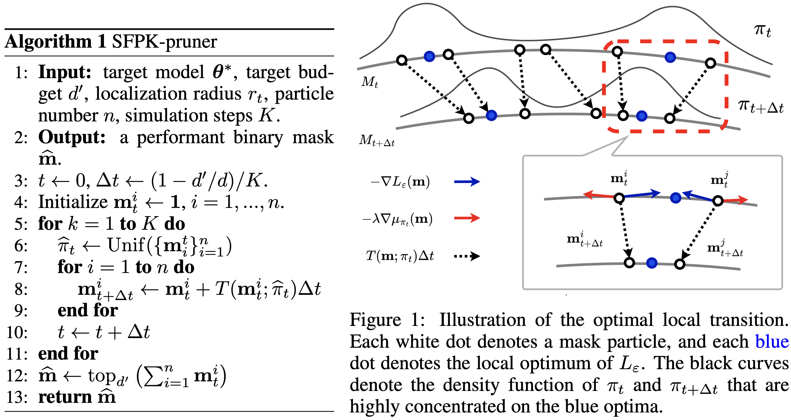

# Official Implementation of Sparsity Evolutionary Fokker-Planck-Kolmogorov Equation (ICLR 2025) 

## Overview

**What is SFPK?** 
This repo contains the pre-release implementation of **S**parsity Evolutionary **F**okker-**P**lanck-**K**olmogorov Equation pruner (**SFPK**-pruner), a novel probabilistic neural network pruner proposed in [SFPK: Probabilistic Neural Pruning via Sparsity Evolutionary Fokker-Planck-Kolmogorov Equation](https://openreview.net/forum?id=hJ1BaJ5ELp). 

Roughly speaking, SFPK explicitly models the evolution of the population (e.g. mask distribution) of the optimal subnetwork as the sparsity progressively increases. Therefore, one can progressively prune a dense model to the target sparsity level, by simulating the SFPK dynamic initialized from the dense model (with $0$-sparsity).

**Why is it termed SFPK?** 
Conceptually similar to the traditional [Fokker-Planck-Kolmogorov (FPK)](https://en.wikipedia.org/wiki/Fokker–Planck_equation) equation, which models the time evolution of particle density in thermodynamics, the proposed SFPK theory offers a closed-form, mathematically tractable approach to approximate the evolution of the optimal subnetwork distribution as sparsity gradually increases, serving as an analog to the FPK equation in probabilistic neural pruning.


**How does SFPK work?**
Intuitively, SFPK-pruner can be interpreted as running an interacting ensemble of $n$ mask trajectories with increasing sparsity. While each mask is pulled by an attraction force (<span style="color:blue">blue arrows</span>) from the local optimum of the next sparsity level, the interaction energy introduces repulsive forces (<span style="color:red">red arrows</span>) between pairs of trajectories, which encourages the trajectories to explore diverse optima. This exploration effect is further enhanced by the gradient noise induced by the mini-batch gradient computation. 

<div align="center">
  
</div>

In practice, our SFPK-pruner is a model-agnostic pruning method since it does not rely on a specific formulation of the model loss with respect to the model parameters and masks. Additionally, one can implement the mask variable as either filter masks, channel masks, or node masks to conduct structured pruning with desired granularity.

-----

## Updates

Currently, we are exploring SFPK on more architectures (i.e., diffusion, GPT) and datasets. We are also working on SFPK acceleration. We welcome any discussions, suggestions, and feedback on SFPK.

- **02-Feb-2025**: SFPK implementation (version 1.0) released.
- **23-Jan-2025**: SFPK is accepted to ICLR 2025.


---


## Installation

To install the dependency:

```bash
pip install -r requirements.txt
```

------

## Usage

Our scripts are tested on NVIDIA A100 GPUs with Python 3.8.12 and PyTorch 1.13.0.

By configuring arguments in `main.py`, one can train target dense model from scratch via `Experiments/pretrain.py`, apply oneshot pruning to a specified model via `Experiments/oneshot.py`, or apply iterative pruning to a specified model via `Experiments/iterative.py`. 

Before executing the scripts, one need to fill the placeholders `<host_name>` `<root>`, `<data_dir>` and `<model_dir>`  in `main.py`, lines 22-36.

To train a ResNet-20 from scratch on CIFAR-100:

```bash
python main.py \
  --exp pretrain \
  --seed 0 \
  --cuda_idx 0 \
  --num_workers 8 \
  --data cifar100 \
  --model resnet20 \
  --use_init
```

To apply $95\%$-sparsity oneshot pruning to ResNet-20 on CIFAR-100 by:

```bash
python main.py \
  --exp oneshot \
  --seed 0 \
  --cuda_idx 0 \
  --num_workers 8 \
  --data cifar100 \
  --model resnet20 \
  --bsz 64 \
  --prn_epochs 1 \
  --ft_epochs 100 \
  --fixed_lr_epochs 0 \
  --lr 1e-2 \
  --warmup_epochs 5 \
  --cold_start_lr 1e-4 \
  --sparsity 0.05 \ # sparsity = remain / total
  --prn_scope global \
  --pruner SFPK \
  --N 100 \
  --r 1.4 \
  --sfpk_n_mask 10 \
  --sfpk_repl_mode exp \
  --sfpk_repl_lam 0.2 \
  --sfpk_repl_weighted \
  --sfpk_vote_ratio 1 \
  --sfpk_vote_mode soft 
  # --structural # for structured pruning
```

To apply $95\%$-sparsity $10$-epoch iterative pruning to ResNet-50-V2 on ImageNet:

```bash
python main.py \
  --exp iterative \
  --seed 0 \
  --cuda_idx 0 \
  --num_workers 8 \
  --data imagenet \
  --model resnet50v2 \
  --bsz 256 \
  --prn_epochs 10 \
  --ft_epochs 50 \
  --fixed_lr_epochs 0 \
  --lr 1e-2 \
  --grad_n_accum 8 \
  --warmup_epochs 5 \
  --cold_start_lr 1e-4 \
  --sparsity 0.05 \ # sparsity = remain / total
  --prn_scope global \
  --pruner SFPK \
  --N 150 \
  --r 5.5 \
  --sfpk_n_mask 10 \
  --sfpk_repl_mode exp \
  --sfpk_repl_lam 0.2 \
  --sfpk_repl_weighted \
  --sfpk_vote_ratio 1 \
  --sfpk_vote_mode soft
```

---

## Thanks 

This repo is heavily borrowed from [SynFlow](https://github.com/ganguli-lab/Synaptic-Flow) and [SpODE](https://github.com/mzf666/sparsity-indexed-ode).

---

## Citation

```bibtex
@inproceedings{
SFPK_iclr2025,
title={Probabilistic Neural Pruning via Sparsity Evolutionary Fokker-Planck-Kolmogorov Equation},
author={Zhanfeng Mo, Haosen Shi, Sinno Jialin Pan},
booktitle={The Thirteenth International Conference on Learning Representations},
year={2025},
url={https://openreview.net/forum?id=hJ1BaJ5ELp}
}
```

